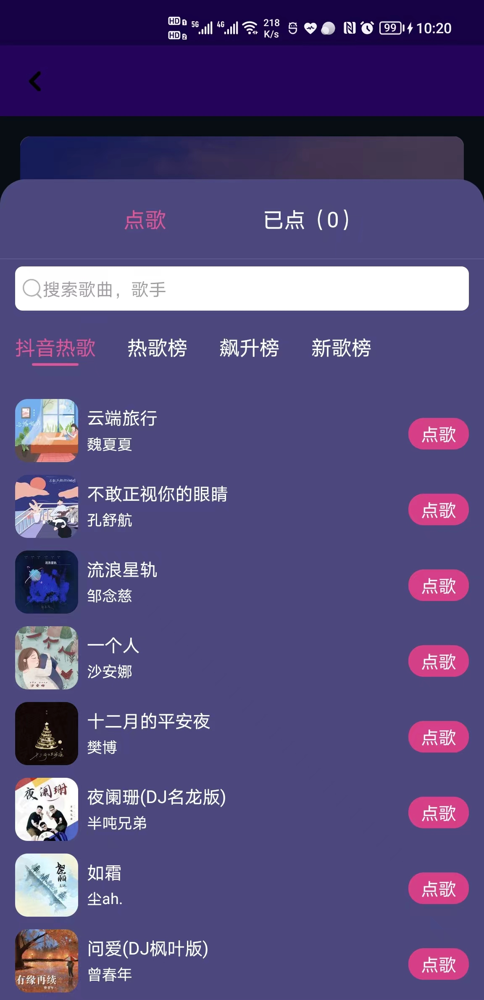
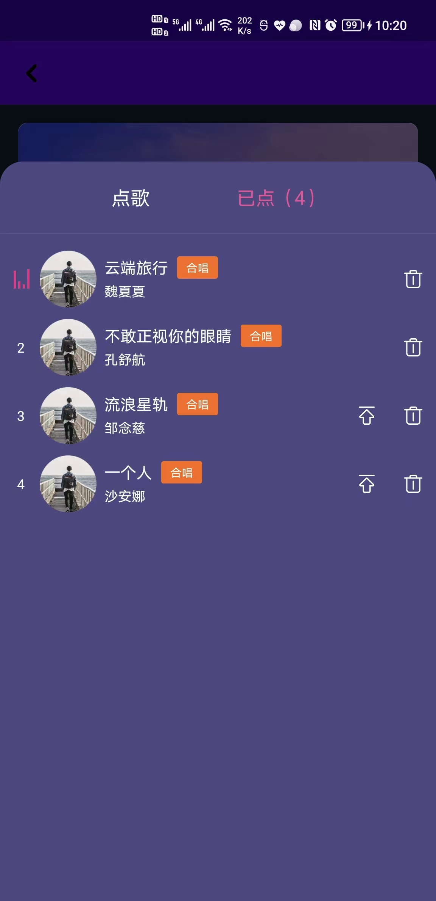
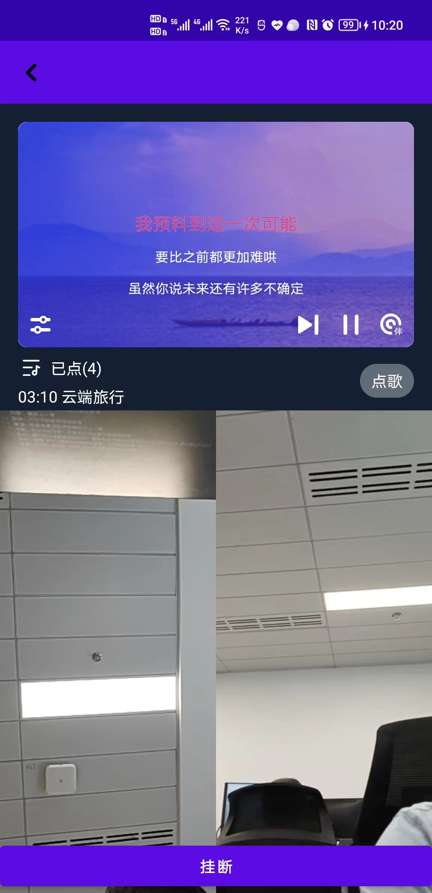
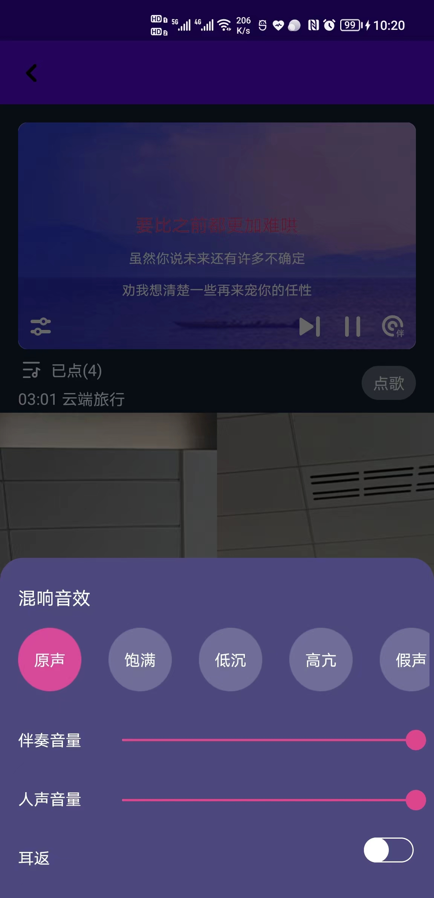

## 简介

本 Demo 是基于 CallLib 开发的 KTV 场景，实现 1V1 视频中双方点歌唱歌的功能。

## 项目结构

- app：登录、首页、KTV房间页面
- ktvmusickit：KTV场景相关组件，包含点歌台，歌词屏幕，调音台等UI及逻辑控制
- coomon：公共组件，包含网络请求，工具类，Base类等

## 功能

- 登录：采用和 RCRTC Demo 同一服务器进行用户登录等
- 连接：启动 App，如果本地有用户信息，则会自动连接 im
- 呼叫：输入对方手机号即可呼叫，用手机号从服务端查询对方id，CallLib 基于用户id呼叫
- 点歌：双方均可点歌，乐库和已点列表从服务端获取
- 置顶：把歌曲置顶到当前播放的下一首
- 删除：从已点列表删除该歌曲
- 切歌：播放下一首
- 播放/暂停：支持K歌过程中播放暂停
- 原唱/伴唱：K歌过程中可以切换原唱伴唱
- 歌词显示：支持逐行歌词和逐字歌词展示，取决于歌词格式
- 调音台：设置混响音效、伴奏音量、人声音量、耳返开关等

## 功能介绍

- 歌曲列表：可以点歌，搜索歌曲等

 

- 歌词屏幕

- 调音台

